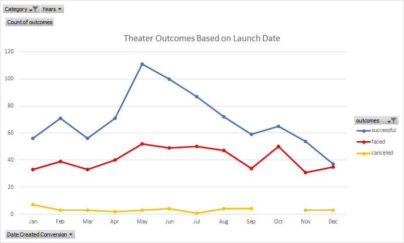
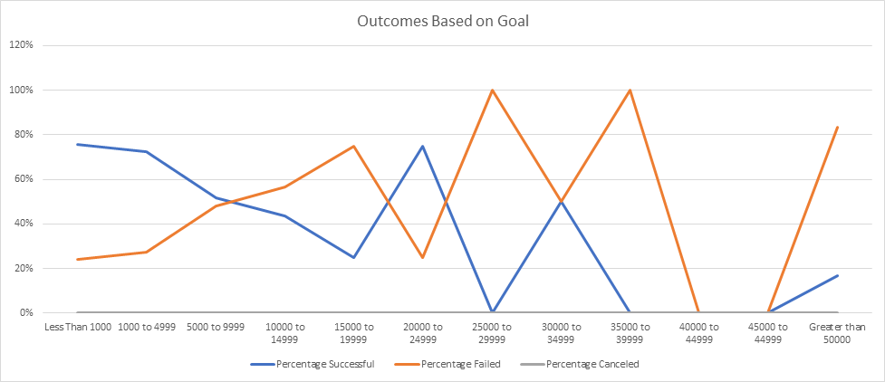

# Kickstarting with Excel

## Overview of Project

Kickstarter Campaign Outcomes Based on Launch Date & Goals

### Purpose

The purpose of this analysis was to determine what, if any, difference
there was among Kickstarter Theater Campaign Outcomes based on when
the campaign was launched, or what the Funding Goal was of the Campaign.

## Analysis and Challenges

The Analysis was performed by summarizing categorical and quantitative data
of past Kickstarter Campaigns provided by the Client in a previously assembled Excel Spreadsheet.

One challenge of this analysis is taking a relatively small number of observations, and using them
to reach concrete and definitive conclusions about projects which undoubtedly have an untold number of differences
between them in the real world.

### Analysis of Outcomes Based on Launch Date

Between the Years 2009 and 2017 there have been a total of 1,369 Theater Kickstarter Campaigns
reflected in this data set. In order to determine if there was a pattern between Success, Failure, or Cancellation
based on Launch Date, a Pivot Table was created to summarize Successful, Failed, and Canceled campaigns
by Month of Launch Date. Once summarized, the Data were plotted in graphical form to allow for easier
interpretation.

The result can be seen in Figure 1:

### Analysis of Outcomes Based on Goals

Additionally, the outcome of campaigns was summarized to see if there was any connection between the size
of the original campaign Goal and the ultimate outcome of the campaign.

The relative percentage of Successful, Failed, or Canceled Campaigns were used as a summary statistic in
this phase of the analysis. While useful as a first-pass, it must be cautioned that many of the number of
campaigns counted in a given category was sometimes a very small number, such as 0, 1, or 2. As a result,
it is dubious at best to draw any definitive conclusions from these results, particularly in the higher
goal categories. More reliable conclusions can be drawn from the results of campaigns with Goals of $15,000
or less where there are more observations available for comparison within each category.

A visual representation of these results can be seen in Figure 2:

### Challenges and Difficulties Encountered

The primary challenges and difficulties encountered during this analysis were the creation, debugging, and error-checking
of the necessary Excel formulas to calculate the summary results for the Outcomes Based on Goals Data. In order to prevent
propagation of errors and reduce the overall number of formulas that needed to be created and manually edited, I broke out
the categorical variables needed for comparison in a separate area of the spreadsheet that could be user-modified. In this way,
the different criteria needed to calculate the results could be entered in a more easily visible location rather than buried
deep within several sets of formulas. These criteria could then be referenced absolutely from within the formulas, which would
themselves remain unchanged. If the desired comparison factors would need to be changed to adjust or update the analysis at a later
time, these criteria could more simply be modified in one single location visible to the user, and all the formulas would therefore
update themselves automatically without needing to be edited.

## Results

### Outcomes Based on Launch Date Conclusions

Two conclusions that can be drawn about the Outcomes based on the Launch Date are:

1. A greater number of Successful campaigns appear to be launched during the Summer
months of May and June. A conclusion that could be drawn from this result is that more people are looking forward
to theatrical productions put on during the Summer, and have more time to dedicate to seeing them.
2. More campaigns fail towards the end of the year in November and December. A conclusion that could be drawn from this is
that more people are spending time with their families during the Holidays, and have greater financial commitments due to travel,
gift buying, and other higher-priority charitable giving already spoken for in their end-of-year budgets.

### Outcomes Based on Goals Conclusions

From the Outcomes based on Goals, we can conclude that for Goals less than $1,000 up to $15,000, there is a strong
negative correlation between Goal Size and Campaign Outcome, with smaller Goals being much more likely to Succeed.
For campaigns with Goals larger than $15,000, the number of observations are much smaller and therefore any
conclusions that could be drawn from the results would be highly suspect and subject to interpretation, other than
the qualitative observation that there are a cluster of highly ambitious large-Goal campaigns in excess of $50,000
that are occasionally successful.

### Limitations of the Dataset

Some limitations of this dataset are that the campaign goals are listed in several different currencies, which at
present are being included together in the summary statistics. For a more robust analysis, these values should all
be either converted to a common currency using agreed-upon exchange rates, or they should be filtered or subsetted
to take them all in turn, or to only perform analysis on one currency and disregard the other values.

Additionally, the categories of Success, Failure, or Canceled are only defined in terms or reaching the stated
funding goal. The fate of each campaign following the Campaign are unknown. Undoubtedly, some projects which
reached their funding goals went on to become "failures" in some other sense. Additional information about what
is actually meant by some of the other fields such as "staff_pick" or "spotlight" could provide additional
clues needed to perform further, more detailed analyses.

### Other Possibilities?

Some other tables and graphs that we could create would be a breakdown of the above results in individual
charts by country, or year. There could be a pattern, for instance, between the timing of Financial Recessions and Pledges
committed to projects such as Kickstarter Theater campaigns.
