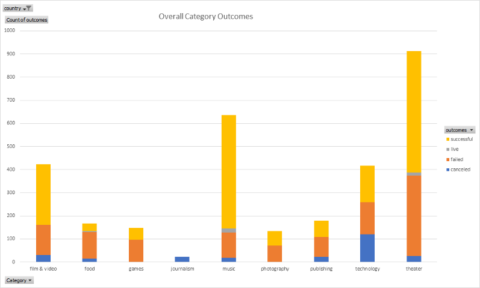

# An Analysis of Kickstarter Campaigns

This project is an analysis of Kickstarter data to uncover trends of Successful and Failed Kickstarter Theater Campaigns in the United States and Great Britain.

## Overview

To aid in the launching of future crowdfunding campaigns for theater productions in the United States and Great Britain, a Historical Analysis was performed on recent Successful and Failed Kickstarter Campaigns in these areas.

Available Data, provided by the client, comprise 4,114 campaigns launched between December 2014 and March 2017, and concluded between January 2015 and May 2017. Overall, the Average Campaign lasts approximately one Month, with the longest campaign concluding after 90 Days.

All 4,114 Campaigns took place in 21 Countries, of which 3,038 (roughly 74%) were in the United States and 604 (roughly 15%) were in Great Britain.

## Findings

Among all types of campaigns in all countries, theater campaigns in general were high in number at 1,393 overall, and fared well in terms of success at a rate of 60%. This is in contrast to Technology campaigns which only succeed approximately 35% of the time. These overall results can be seen in Figure 1: .

In the United States, over Half of Theater Campaigns
