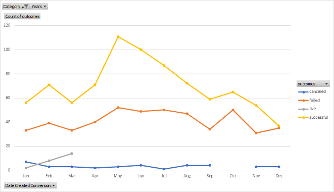
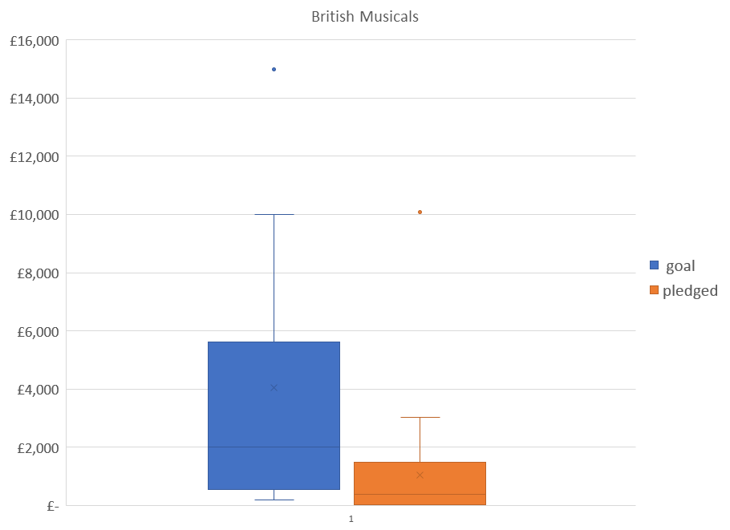
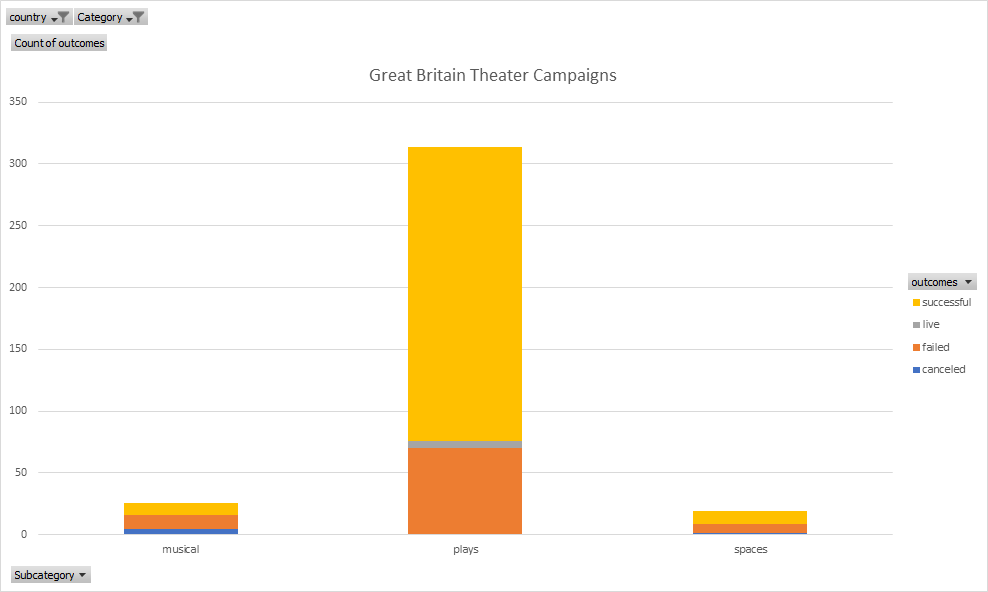

# An Analysis of Kickstarter Campaigns

This project is an analysis of Kickstarter data to uncover trends of Successful and Failed Kickstarter Theater Campaigns in the United States and Great Britain.

## Overview

To aid in the launching of future crowdfunding campaigns for theater productions in the United States and Great Britain, a Historical Analysis was performed on recent Successful and Failed Kickstarter Campaigns in these areas.

Available Data, provided by the client, comprise 4,114 campaigns launched between December 2014 and March 2017, and concluded between January 2015 and May 2017. All 4,114 Campaigns took place in 21 Countries, of which 3,038 (roughly 74%) were in the United States and 604 (roughly 15%) were in Great Britain.

Overall, the Average Campaign lasts approximately one Month, with the longest campaign concluding after 90 Days. The Average Number of Backers is 112 for all campaigns, and 46 for theater campaigns. To avoid discrepancies with Currency Values, the Average Donation in the United States alone is $80 per Backer for both overall campaigns and theater campaigns.

## Findings

Among all types of campaigns in all countries, theater campaigns in general were high in number at 1,393, and fared well in terms of success at a rate of 60%. This is in contrast to Technology campaigns which only succeed approximately 35% of the time. These results can be seen in greater detail in Figure 1:

For theater campaigns in particular, one trend that stood out upon inspection was the degree of seasonality, especially among the successful campaigns. More successful campaigns were launched in May and June compared to other months of the year, as can be seen in Figure 2:

If you examine the differences between Successful and Failed Theater Campaigns in the US, some other trends are revealed as well. Failed campaigns started with a Goal twice as large as Successful campaigns on average ($5,000 vs $10,000), and had Average Pledge amounts nearly Ten Times smaller ($550 vs $5,500)! There were marked differences in the Number and Type of Backers as well: Successful campaigns had more backers (Average of 60 vs 7), and a higher proportion of large average donations. In contrast, Failed campaigns ended with a smaller number of Backers and smaller average donations.

Turning our attention overseas, the outlook for putting on a Musical in Great Britain is quite a bit different, and poses a greater challenge. The Average Goal for these productions during the period under study was 4,000 Pounds, but the Average Amount Pledged was not even Half this amount. This stark contrast can be seen in a side-by side comparison in Figure 3:

What does seem to work in Great Britain are campaigns for Plays, as can be seen below in Figure 4:

## Recommendations

In conclusion, we can provide the following recommendations to increase the liklihood of a successful campaign:

1. Launch your campaign in the Month of May.
2. Be realistic with your Goal, with a request no larger than $5,000.
3. Cast a wide net to generate interest among potential Backers.
4. Make sure that your pitch is polished enough and the project itself is interesting enough to attract "Big Fish" Backers who would be more willing to contribute a larger Pledge Amount.
5. If the campaign is to be conducted in Great Britain, strongly consider a Play rather than a Musical.
